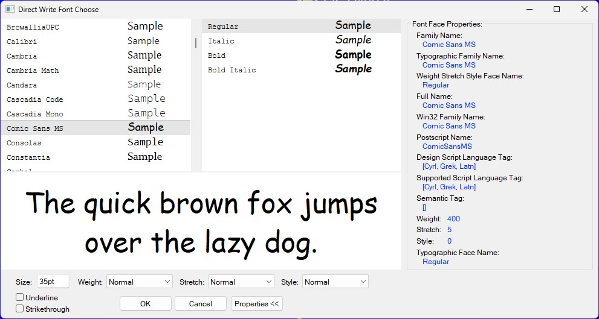

Enumerates all the fonts, with all available styles, installed in the system.  
This resembles the standard Windows **GDI** [ChooseFont]() dialog, but works with the **DirectWrite** subsystem. All sample fonts rendering is done with the **Direct2D**.  
The dialog can easily be added into any C++ project as C++20 modules. Written in pure Win32 API, no any other dependencies.  

On dialog exit a `std::optional<DWFONTINFO>` is returned. The `DWFONTINFO` struct possesses all the choosen font's information, similar to `LOGFONT`. This information can then be used to create text format object with the [`IDWriteFactory::CreateTextFormat`](https://learn.microsoft.com/en-us/windows/win32/api/dwrite/nf-dwrite-idwritefactory-createtextformat) Direct2D method call.

## Usage
1. Add all files from the **DWFontChoose** subdirectory into your project
1. `import DWFontChoose;`
1. Call the `DWFontChoose();` global method
```cpp
import DWFontChoose;

int WinMain() {
    const auto optFontInfo = DWFontChoose();
    ...
    return 0;
}
```

## DWFONTINFO
```cpp
struct DWFONTINFO {
    std::wstring        wstrFamilyName;
    std::wstring        wstrLocale;
    DWRITE_FONT_WEIGHT  eWeight { };
    DWRITE_FONT_STRETCH eStretch { };
    DWRITE_FONT_STYLE   eStyle { };
    float               flSizeDIP { }; //Font size in Device Independent Pixels (not points).
};
```