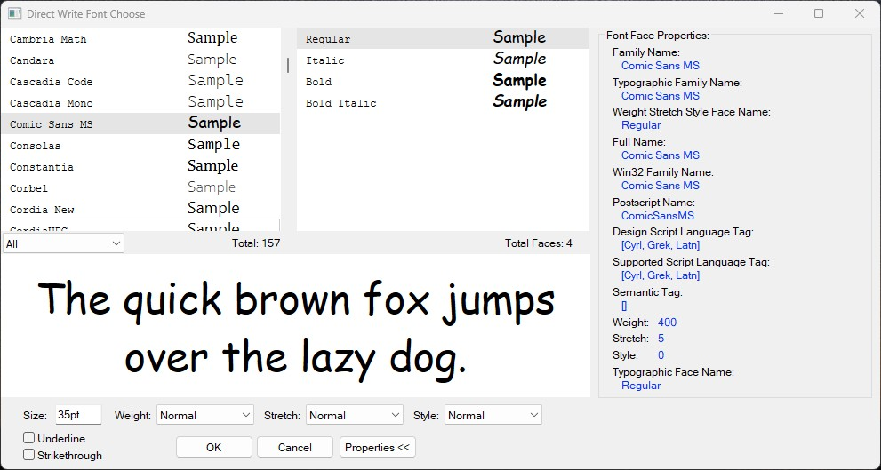

Lists all fonts with all available styles installed in the system, and allows you to select the desired one.  
This resembles the standard **Windows GDI** [ChooseFont](https://learn.microsoft.com/en-us/previous-versions/windows/desktop/legacy/ms646914(v=vs.85)) dialog, but works with the **DirectWrite** subsystem. All font examples are rendered using **Direct2D**.  
The dialog can easily be added into any C++ project as a C++20 module.  
It's written in pure **Win32 API**, no any other dependencies.  

On dialog exit a `std::optional<DWFONTCHOOSE::DWFONTINFO>` is returned. The `DWFONTINFO` struct contains all the information about the selected font, similar to the `LOGFONT` struct.
 This information can then be used to create text format object with the [`IDWriteFactory::CreateTextFormat`](https://learn.microsoft.com/en-us/windows/win32/api/dwrite/nf-dwrite-idwritefactory-createtextformat) **Direct2D** method.

## Usage
1. Add all files from the **DWFontChoose** subdirectory into your project
1. `import DWFontChoose;`
1. Call the `DWFONTCHOOSE::DWFontChoose();` function
```cpp
import DWFontChoose;

int WinMain() {
   	const auto optFontInfo = DWFONTCHOOSE::DWFontChoose();
    ...
    return 0;
}
```

## DWFONTINFO
```cpp
struct DWFONTINFO {
    std::wstring        wstrFamilyName;
    std::wstring        wstrLocale;
    DWRITE_FONT_WEIGHT  eWeight { };
    DWRITE_FONT_STRETCH eStretch { };
    DWRITE_FONT_STYLE   eStyle { };
    float               flSizeDIP { }; //Font size in Device Independent Pixels (not points).
};
```